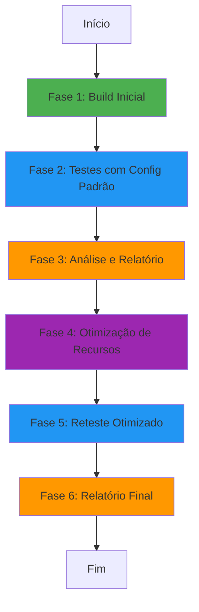
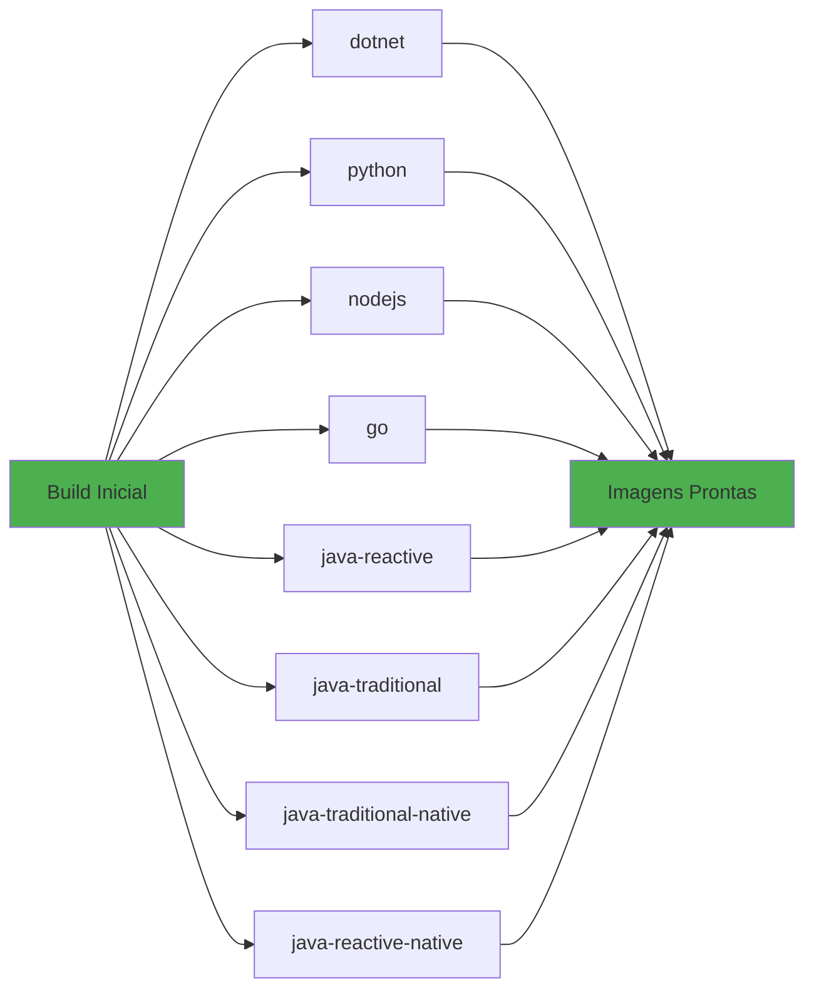
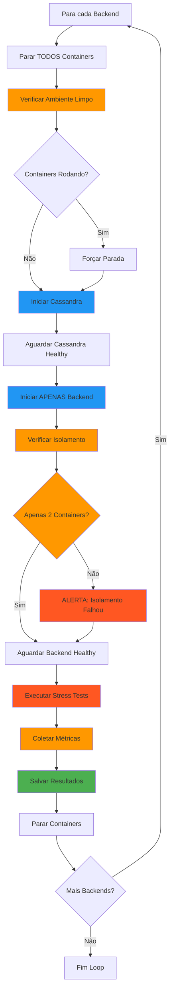
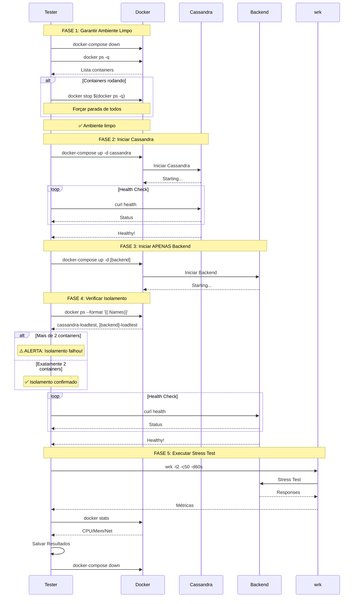
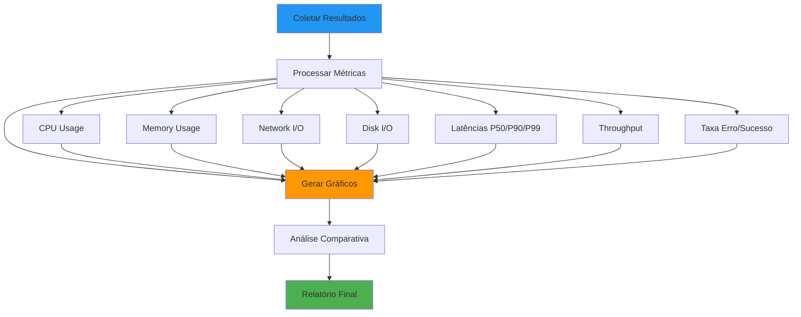
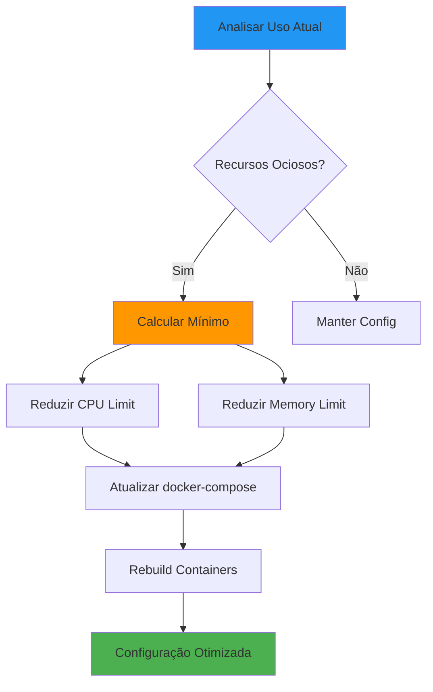
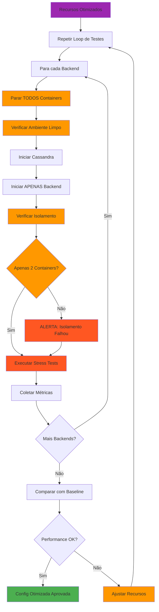
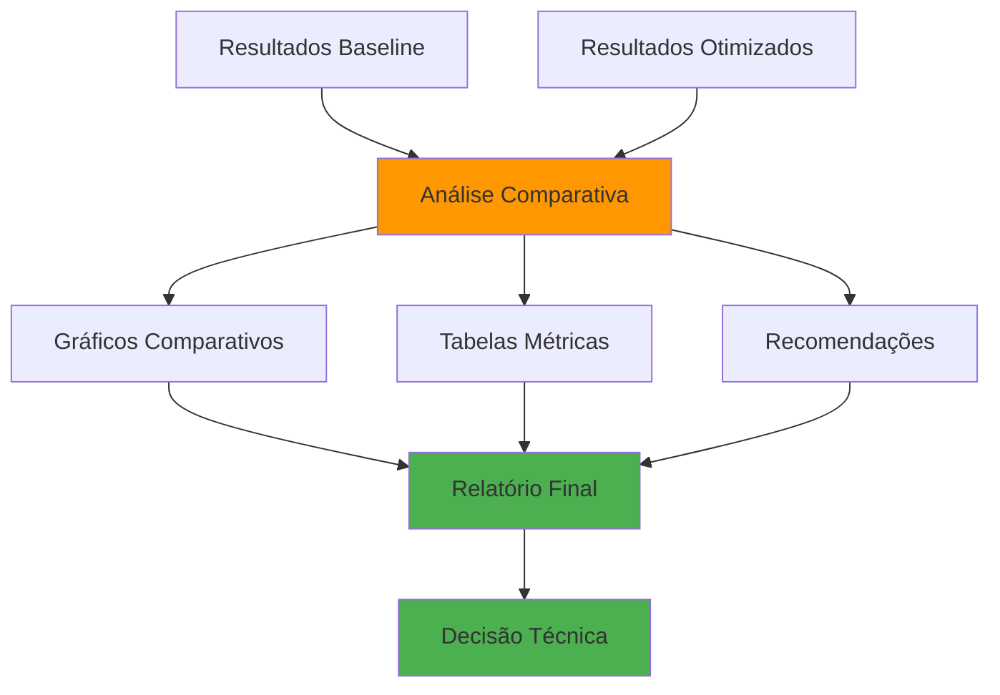

# Workflow de Testes de Stress - Beauty Salon Backends

**Objetivo:** Executar testes de stress comparativos em todos os backends  
**Data:** 26 de Outubro de 2025  
**Backends:** 8 implementações

---

## 📋 Backends a Testar

1. **dotnet** - .NET Core ASP.NET
2. **python** - Python FastAPI
3. **nodejs** - Node.js Express
4. **go** - Go Gin
5. **java-reactive** - Java Spring WebFlux (JVM)
6. **java-traditional** - Java Spring Boot (JVM)
7. **java-traditional-native** - Java Spring Boot (GraalVM Native)
8. **java-reactive-native** - Java Spring WebFlux (GraalVM Native)

---

## 🔄 Fluxo Principal



---

## 📦 Fase 1: Build de Todos os Backends



### Comandos

```bash
# Build de todos os backends
docker-compose -f docker-compose.loadtest.yml build

# Verificar imagens criadas
docker images | grep beauty-salon
```

---

## 🔁 Fase 2: Loop de Testes (Config Padrão)

### ⚠️ REGRA CRÍTICA: Isolamento de Containers

**Cada teste DEVE executar com apenas 2 containers:**
1. ✅ Cassandra (banco de dados)
2. ✅ Backend sendo testado

**Nenhum outro container pode estar rodando!**



### Detalhamento por Backend



### 🎯 Por que Isolamento é Crítico?

**Razões para executar apenas Cassandra + Backend:**

1. **Precisão das Métricas**
   - CPU e memória medidos são exclusivos do backend testado
   - Sem interferência de outros processos
   - Resultados comparáveis entre testes

2. **Recursos Dedicados**
   - Todo CPU disponível para o backend
   - Toda memória disponível para o backend
   - Sem competição por recursos

3. **Reprodutibilidade**
   - Ambiente idêntico em todos os testes
   - Resultados consistentes
   - Comparações justas

4. **Detecção de Problemas**
   - Vazamentos de memória ficam evidentes
   - CPU spikes são do backend testado
   - Network I/O é real do teste

**⚠️ Violação do Isolamento = Resultados Inválidos!**

---

## 📊 Fase 3: Geração de Relatório Comparativo



### Métricas Coletadas

| Categoria | Métricas |
|-----------|----------|
| **Performance** | Throughput (req/s), Latência Média, P50, P90, P99, Latência Mín/Máx |
| **Recursos** | CPU (%), Memory (MB), Disk I/O (MB/s), Network I/O (MB/s) |
| **Confiabilidade** | Taxa de Sucesso (%), Taxa de Erro (%), Total Requisições |
| **Escalabilidade** | Req/s por CPU, Req/s por MB RAM |

---

## ⚙️ Fase 4: Otimização de Recursos



### Estratégia de Otimização

```yaml
# Antes (Config Padrão)
deploy:
  resources:
    limits:
      cpus: '1.0'
      memory: 512M
    reservations:
      cpus: '0.5'
      memory: 256M

# Depois (Otimizado)
deploy:
  resources:
    limits:
      cpus: '0.5'      # Reduzido 50%
      memory: 256M     # Reduzido 50%
    reservations:
      cpus: '0.25'     # Reduzido 50%
      memory: 128M     # Reduzido 50%
```

---

## 🔁 Fase 5: Reteste com Recursos Otimizados

### ⚠️ MESMA REGRA: Isolamento Obrigatório

**Fase 5 segue as MESMAS regras da Fase 2:**
- ✅ Apenas Cassandra + Backend sendo testado
- ✅ Verificação de ambiente limpo antes de cada teste
- ✅ Verificação de isolamento após iniciar backend
- ✅ Nenhum outro container pode estar rodando



---

## 📈 Fase 6: Relatório Final Comparativo



---

## 🔧 Scripts de Automação

### Script Principal

```bash
#!/bin/bash
# stress-test-all.sh

BACKENDS=(
    "dotnet-backend:5001"
    "python-backend:8000"
    "nodejs-backend:3000"
    "go-backend:8080"
    "java-reactive-jvm:8085"
    "java-jvm:10001"
    "java-native:10002"
    "java-reactive-native:8086"
)

RESULTS_DIR="./results/$(date +%Y%m%d_%H%M%S)"
mkdir -p "$RESULTS_DIR"

echo "🚀 Iniciando testes de stress em todos os backends..."

for backend_config in "${BACKENDS[@]}"; do
    IFS=':' read -r backend port <<< "$backend_config"
    
    echo ""
    echo "========================================="
    echo "🔍 Testando: $backend"
    echo "========================================="
    
    # 1. Parar todos os containers
    echo "⏹️  Parando containers..."
    docker-compose -f docker-compose.loadtest.yml down
    
    # 2. Iniciar Cassandra
    echo "🗄️  Iniciando Cassandra..."
    docker-compose -f docker-compose.loadtest.yml up -d cassandra
    
    # 3. Aguardar Cassandra healthy
    echo "⏳ Aguardando Cassandra..."
    until docker exec cassandra-loadtest cqlsh -e "DESCRIBE KEYSPACES" > /dev/null 2>&1; do
        sleep 2
    done
    echo "✅ Cassandra pronto!"
    
    # 4. Iniciar backend
    echo "🚀 Iniciando $backend..."
    docker-compose -f docker-compose.loadtest.yml up -d "$backend"
    
    # 5. Aguardar backend healthy
    echo "⏳ Aguardando $backend..."
    sleep 30
    until curl -f "http://localhost:$port/health" > /dev/null 2>&1; do
        sleep 5
    done
    echo "✅ $backend pronto!"
    
    # 6. Executar stress test
    echo "💪 Executando stress test..."
    wrk -t2 -c50 -d60s --latency "http://localhost:$port/api/customers" \
        > "$RESULTS_DIR/${backend}_wrk.txt"
    
    # 7. Coletar métricas Docker
    echo "📊 Coletando métricas..."
    docker stats --no-stream --format "table {{.Name}}\t{{.CPUPerc}}\t{{.MemUsage}}\t{{.NetIO}}\t{{.BlockIO}}" \
        > "$RESULTS_DIR/${backend}_docker_stats.txt"
    
    # 8. Salvar logs
    docker logs "${backend}-loadtest" > "$RESULTS_DIR/${backend}_logs.txt" 2>&1
    
    echo "✅ Teste concluído: $backend"
done

echo ""
echo "========================================="
echo "✅ Todos os testes concluídos!"
echo "📁 Resultados salvos em: $RESULTS_DIR"
echo "========================================="

# Parar todos os containers
docker-compose -f docker-compose.loadtest.yml down
```

### Script de Análise

```bash
#!/bin/bash
# analyze-results.sh

RESULTS_DIR="$1"

if [ -z "$RESULTS_DIR" ]; then
    echo "Uso: $0 <diretório_resultados>"
    exit 1
fi

echo "# Relatório Comparativo de Performance" > "$RESULTS_DIR/REPORT.md"
echo "" >> "$RESULTS_DIR/REPORT.md"
echo "**Data:** $(date)" >> "$RESULTS_DIR/REPORT.md"
echo "" >> "$RESULTS_DIR/REPORT.md"

echo "| Backend | Req/s | Latência Média | P50 | P90 | P99 | CPU | Memory |" >> "$RESULTS_DIR/REPORT.md"
echo "|---------|-------|----------------|-----|-----|-----|-----|--------|" >> "$RESULTS_DIR/REPORT.md"

for wrk_file in "$RESULTS_DIR"/*_wrk.txt; do
    backend=$(basename "$wrk_file" _wrk.txt)
    
    # Extrair métricas do wrk
    req_sec=$(grep "Requests/sec:" "$wrk_file" | awk '{print $2}')
    latency_avg=$(grep "Latency" "$wrk_file" | head -1 | awk '{print $2}')
    p50=$(grep "50%" "$wrk_file" | awk '{print $2}')
    p90=$(grep "90%" "$wrk_file" | awk '{print $2}')
    p99=$(grep "99%" "$wrk_file" | awk '{print $2}')
    
    # Extrair métricas Docker
    stats_file="$RESULTS_DIR/${backend}_docker_stats.txt"
    cpu=$(grep "$backend" "$stats_file" | awk '{print $2}')
    mem=$(grep "$backend" "$stats_file" | awk '{print $3}')
    
    echo "| $backend | $req_sec | $latency_avg | $p50 | $p90 | $p99 | $cpu | $mem |" >> "$RESULTS_DIR/REPORT.md"
done

echo "" >> "$RESULTS_DIR/REPORT.md"
echo "✅ Relatório gerado: $RESULTS_DIR/REPORT.md"
```

---

## 📊 Exemplo de Relatório Final

```markdown
# Relatório Comparativo - Baseline vs Otimizado

## Configuração Baseline (1 CPU, 512MB)

| Backend | Req/s | P99 | CPU | Memory |
|---------|-------|-----|-----|--------|
| nodejs | 4,667 | 50.69ms | 85% | 380MB |
| java-jvm | 3,664 | 321.96ms | 92% | 450MB |
| go | 3,148 | 56.88ms | 78% | 120MB |

## Configuração Otimizada (0.5 CPU, 256MB)

| Backend | Req/s | P99 | CPU | Memory | Δ Req/s |
|---------|-------|-----|-----|--------|---------|
| nodejs | 3,200 | 65ms | 95% | 220MB | -31% |
| java-jvm | 2,100 | 450ms | 98% | 240MB | -43% |
| go | 2,800 | 70ms | 92% | 110MB | -11% |

## Recomendações

1. **Go** - Melhor eficiência com recursos limitados (-11% throughput)
2. **Node.js** - Boa performance mas requer mais recursos
3. **Java JVM** - Não recomendado para recursos limitados
```

---

## ✅ Checklist de Execução

### Pré-requisitos
- [ ] Docker e Docker Compose instalados
- [ ] wrk instalado (`brew install wrk`)
- [ ] Cassandra configurado
- [ ] Todos os backends buildados

### Fase 1: Build
- [ ] Build de todos os backends
- [ ] Verificar imagens criadas
- [ ] Testar inicialização manual

### Fase 2: Testes Baseline
- [ ] Executar testes em todos os backends
- [ ] Coletar métricas completas
- [ ] Salvar resultados

### Fase 3: Análise
- [ ] Processar resultados
- [ ] Gerar gráficos
- [ ] Criar relatório comparativo

### Fase 4: Otimização
- [ ] Analisar uso de recursos
- [ ] Calcular configuração mínima
- [ ] Atualizar docker-compose

### Fase 5: Reteste
- [ ] Executar testes otimizados
- [ ] Comparar com baseline
- [ ] Validar performance

### Fase 6: Relatório Final
- [ ] Consolidar resultados
- [ ] Gerar recomendações
- [ ] Documentar decisões

---

## 🎯 Objetivos de Sucesso

| Objetivo | Meta |
|----------|------|
| Backends Testados | 8/8 (100%) |
| Métricas Coletadas | Completas |
| Relatório Gerado | Sim |
| Otimização Aplicada | Sim |
| Decisão Técnica | Clara |

---

**Status:** 📋 Pronto para Execução  
**Tempo Estimado:** 4-6 horas  
**Automação:** 90%
